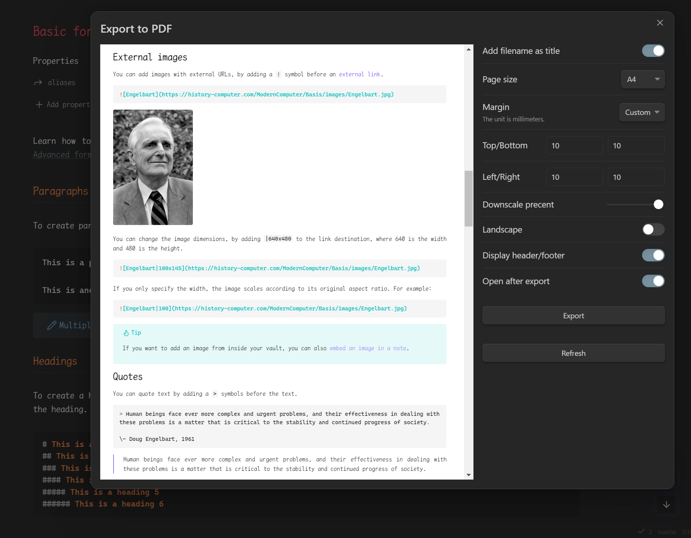
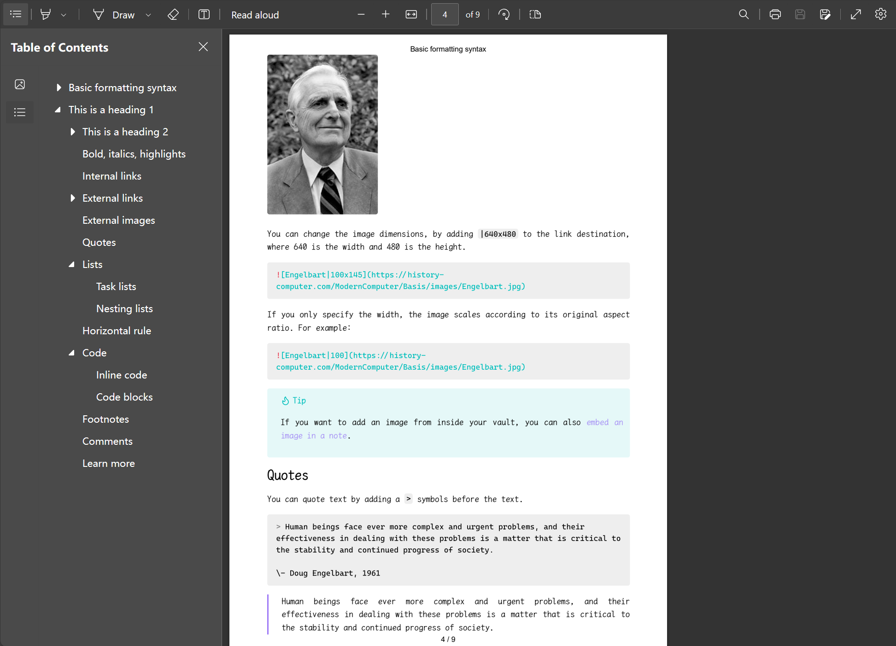

# Obsidian Better Export PDF

English | [中文](./README.zh.md)

Better Export PDF is an Obsidian PDF export enhancement plugin that adds the ability to export bookmarks outline, export preview and add page numbers to PDF compared to the official PDF export function.

## Features

Compared to the official Export PDF feature:

- 🚀Support export preview
- 🎉Export the outline bookmarks
- 🛩️Customize the margins
- ✨Export the page numbers
- 💥Support add PDF metadata from front matter
- 🎇Export internal links within file
- 🎈Export multiple Markdown files into one PDF file
- ... ...

## Installation

In Obsidian go to `Settings > Third-party plugins > Community Plugins > Browse` and search for [`Better Export PDF`](obsidian://show-plugin?id=better-export-pdf).

### Manual installation

1. Download the .zip file from [the latest Release](https://github.com/l1xnan/obsidian-better-export-pdf/releases), or from any other release version.
2. Unzip into: `{VaultFolder}/.obsidian/plugins/`
3. Reload Obsidian and enable the plug-in.

or use the [BRAT Plugin](https://obsidian.md/plugins?id=obsidian42-brat).

## Usage

1. In the upper right corner of the current Markdown view, click More options and select `Better Export PDF`;
2. Open the command panel and select `Better Export PDF: Export Current File to PDF`.

If the exported PDF page is abnormal, trying to change the color in the appearance will switch to a light color.

### Settings

Set page numbers using the `Header Template` and `Footer Template`, for example:

```html
<div style="width: 100vw;font-size:10px;text-align:center;">
  <span class="pageNumber"></span> / <span class="totalPages"></span>
</div>
```

See details [`<webview>.printToPDF(options)`](https://www.electronjs.org/docs/latest/api/webview-tag#webviewprinttopdfoptions).

If you want to further customize the PDF export style, you can add custom CSS in the `Appearance > CSS Snippet`, such as custom fonts and sizes:

```css
@media print {
  body {
    font-size: 20px !important;
    font-family: "Times New Roman" !important;
  }
}
```

### frontMatter

PDF Metadata can be added to through frontMatter of the configuration document. Supported field items are:

- `title`
- `author`
- `keywords`
- `created_at`
- `updated_at`
- `creator`
- `producer`

Document level header/footer templates can also be configured in frontMatter:

- `headerTemplate`
- `footerTemplate`

### Export multiple Markdown files (not release)

#### Quick export

Select the folder in the sidebar, right-click the menu `Export folder to PDF`, you can export the entire folder contents to a PDF file.

Note: This does not guarantee the file export order.

#### Custom export

Create a new table of contents note, add something like the following, need to add a `toc: true` document property:


```markdown
---
toc: true
---

## Table of Contents

[[Note1|Title1]]
[[Note2]]
[[Note2]]
```

This allows the plugin to export the notes in the order of the internal links. The anchor point of the exported PDF table of contents supports clicking to jump.

### Export preview



### Effect picture



## TODO

- [ ] Automatically adds internal link content to footnotes/appendices;
- [ ] Support pagedjs beautification;
- [x] Support print preview;
- [ ] Export multiple Markdown files into one PDF file;
- [ ] Improves default `@media print` css style;
- [x] Support add PDF metadata from front matter;
- [x] Export internal links within file;

## Support This Plugin

This plugin takes a lot of work to maintain and continue adding features. If you want to fund the continued development of this plugin you can do so here:

<a href="https://www.buymeacoffee.com/l1xnan"></a>
